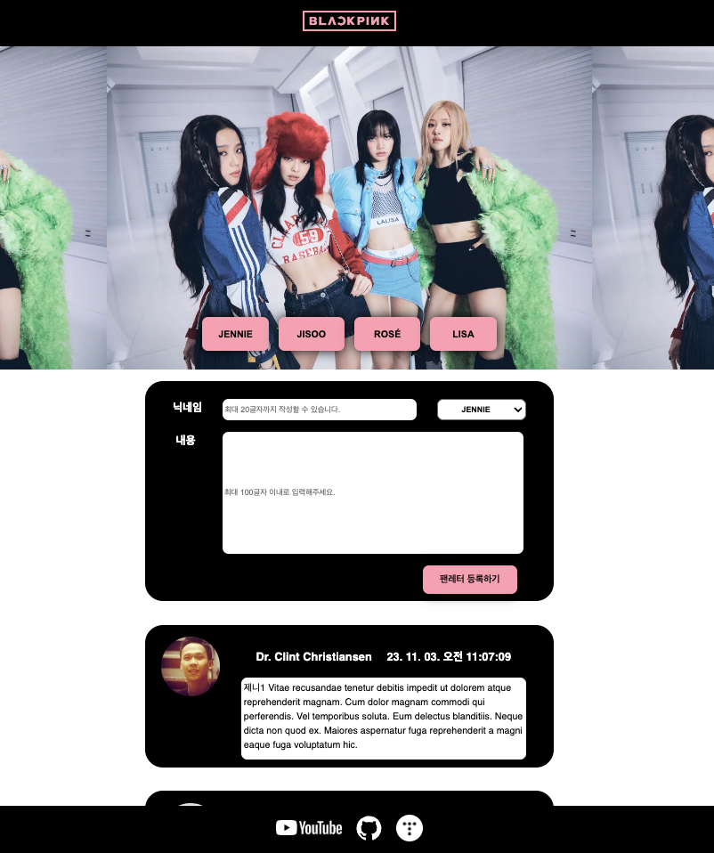
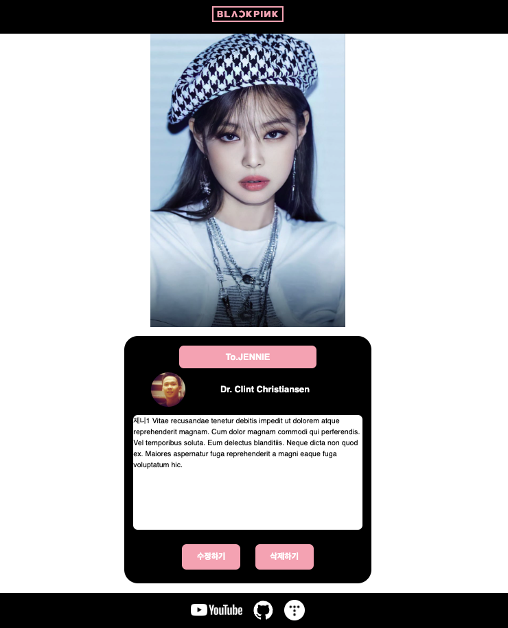

<h1>💌 그룹 아티스트 Fan Letter 만들기</h1>

 

<h1>💻 STACKS</h1>

     

 

## **페이지와 기능**

### **✅ MainPage**

#### 1. 닉네임과 내용을 입력하고, 멤버를 선택하면 해당 멤버에게 쓴 팬레터가 저장된다.

#### 2. 상단 `LetterForm`의 멤버 이름을 누르면 멤버별로 팬레터가 분류된다.

#### 3. 작성 팬레터를 누르면 `상세페이지`로 이동한다.

### **✅ DetailPage**

#### 1. `수정하기` 버튼을 누르면 내용 수정이 가능하고, `수정완료` 버튼을 누르면 수정된 상태로 홈 화면으로 이동한다.

#### 2. `삭제하기` 버튼을 누르면 해당 letter는 삭제가 되고, 홈 화면으로 이동한다.

### **✅ Header와 Footer**

#### - Header : BLACKPINK 로고 누르면 MainPage 홈화면으로 이동

#### - Footer : Youtube / Github / Blog 링크 연결

### **✅ MyPage**

#### 1. 개인 프로필 변경

### **✅ LoginPage**

#### 1. 페이지 로그인 하기

### **✅ SignupPage**

#### 1. 회원가입 기능

 

## **컴포넌트 구조**

### **`component` 구조 확인하기**

 

## **어려웠던 점 🧐**

-
